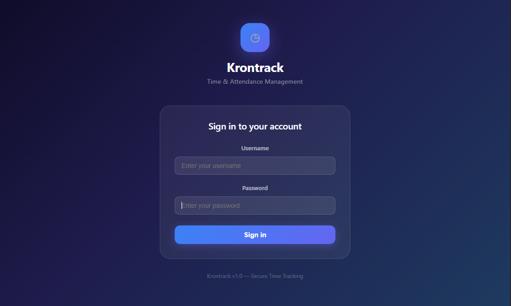
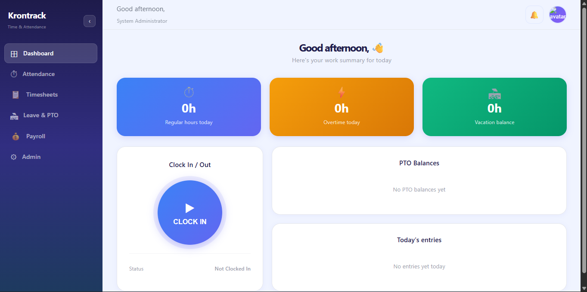
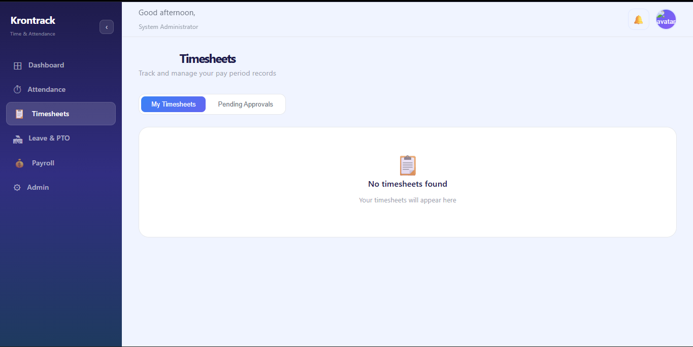
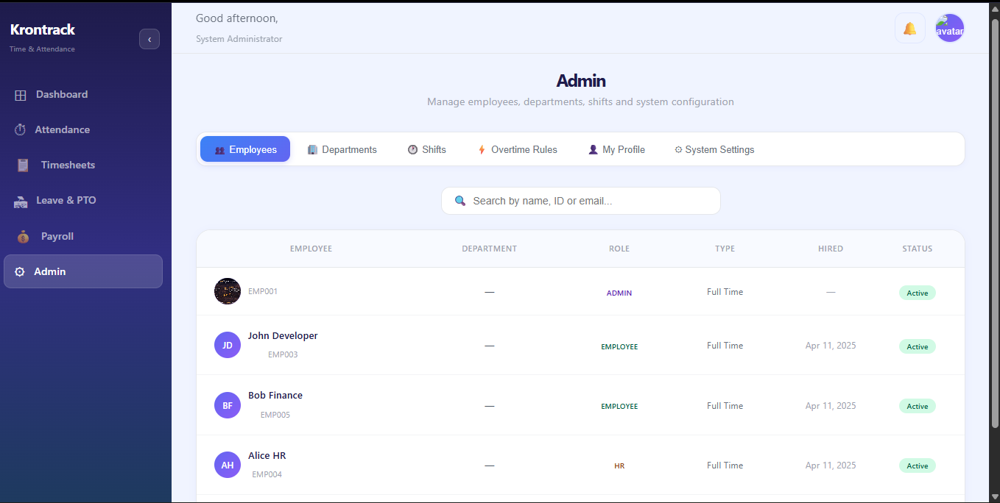

<div align="center">

# ⏱ Krontrack

### Production-Ready Employee Time & Attendance Management System


---
### Production-Ready Employee Time & Attendance Management System

---

<!--
### Production-Ready Employee Time & Attendance Management System

-->

### Screenshots

| Login | Dashboard |
|-------|-----------|
|  |  |

| Timesheets | Admin Panel |
|------------|-------------|
|  |  |


---

## ⚠️ IMPORTANT NOTICE

> **🚧 THIS PROJECT IS CURRENTLY IN ACTIVE DEVELOPMENT**
>
> Krontrack is a **skill-development project** built to demonstrate full-stack engineering capabilities
> across Django, React, PostgreSQL, Redis, Celery, WebSockets, Docker, and production DevOps practices.
>
> **THIS SOFTWARE IS NOT FREE TO USE.**
> Any commercial use, redistribution, white-labelling, or deployment in a production environment
> without explicit written permission from the author is strictly prohibited.
>
> If you are interested in using or licensing Krontrack for your organization,
> it can be **fully reconfigured and customized** to your specific HR workflows,
> company policies, payroll integrations, and branding.
>
> Contact: **Emmanuel M. Jesse** · Dev Kenya
> GitHub: [github.com/emmanueljesse](https://github.com)

---

## 📋 Table of Contents

- [Overview](#overview)
- [Features](#features)
- [Architecture](#architecture)
- [Tech Stack](#tech-stack)
- [System Design](#system-design)
- [Getting Started](#getting-started)
- [API Reference](#api-reference)
- [Role-Based Access](#role-based-access)
- [SSO Integration](#sso-integration)
- [Docker Deployment](#docker-deployment)
- [Configuration](#configuration)
- [Skills Demonstrated](#skills-demonstrated)
- [Roadmap](#roadmap)
- [License](#license)

---

## 🎯 Overview

Krontrack is a **comprehensive employee time and attendance tracking system** built as a
full-stack engineering showcase. It handles everything from simple clock-ins to complex
payroll period management, overtime calculations, and HR system integrations.

The system is designed with a **plugin architecture** that allows it to be dropped into
any existing HR or employee management system with minimal configuration — making it
ideal for organizations that already have HR tools but need a dedicated time-tracking layer.

**This is not a tutorial project.** Every component — from the database schema to the
WebSocket consumers to the React state management — is built to production standards.

---

## ✨ Features

### 🕐 Time & Attendance
- **Multi-method clock-in**: Web browser, mobile PWA, PIN kiosk, QR code, manager entry
- **GPS geofencing**: Validate clock-ins are within a configured radius of the workplace
- **Live elapsed timer**: Real-time display of hours worked since clock-in
- **Break tracking**: Start/end breaks with type classification (meal, rest, personal)
- **Missed punch detection**: Automatic alerts when employees forget to clock out
- **Audit trail**: Every edit logged with actor, timestamp, before/after data

### 📋 Timesheets
- **Automated aggregation**: Hours compiled from time entries per pay period
- **Approval workflow**: Draft → Submitted → Approved/Rejected → Locked
- **Period locking**: Automatic lock on configurable day of month
- **Overtime calculation**: Daily and weekly thresholds with configurable multipliers
- **Bulk operations**: Approve or export multiple periods simultaneously
- **Manager override**: Edit individual punches with reason tracking

### 🏖 Leave & PTO
- **Multiple leave types**: Vacation, sick, personal, bereavement, unpaid, other
- **Accrual engine**: Automatic PTO balance calculation via Celery Beat scheduler
- **Request workflow**: Submit → Manager/HR review → Approve/Reject with notes
- **Balance tracking**: Running balance updated on approval
- **Policy configuration**: Configurable accrual rates, caps, carry-over limits

### 💰 Payroll
- **Report generation**: Export payroll summaries as CSV, PDF, or JSON
- **Multi-format output**: Integrates with downstream payroll processors
- **Department filtering**: Run reports for specific departments or company-wide
- **Gross pay calculation**: Based on hourly rates × regular and overtime hours

### 🔔 Notifications
- **Real-time**: WebSocket-powered live notifications (no page refresh needed)
- **In-app + email**: Dual-channel notification delivery
- **Smart alerts**: Missed punches, timesheet deadlines, approval results, PTO updates
- **Unread badge**: Live count on the notification bell

### 🔐 Authentication & Security
- **JWT tokens**: Access + refresh token rotation with blacklisting
- **SSO support**: Google, Microsoft OAuth2 — auto-provisions employee profiles
- **HR system SSO**: Connect any OAuth2-compatible HR platform
- **RBAC**: Four roles with granular permission enforcement at API level

### ⚙ Admin & Configuration
- **Employee management**: Full CRUD with search, role assignment, department mapping
- **Department management**: Create departments, assign managers
- **Shift configuration**: Define work schedules with grace periods and day selection
- **Overtime rules**: Daily/weekly thresholds with multiplier configuration
- **Profile management**: Avatar upload, timezone, password change
- **System settings**: All config visible and documented in the admin panel

---

## 🏗 Architecture
┌─────────────────────────────────────────────────────────────┐
│                      React Frontend                          │
│         Vite + TypeScript + Zustand + React Query            │
└──────────────────────┬──────────────────────────────────────┘
│ REST API (JWT) + WebSocket
┌──────────────────────▼──────────────────────────────────────┐
│                   Django Backend                              │
│   DRF + Channels + Celery + Social Auth + Plugin Layer        │
├─────────┬──────────┬──────────┬──────────┬──────────────────┤
│  core   │attendance│timesheets│  leave   │    payroll        │
│  rules  │   auth   │  notify  │integrat. │    admin          │
└─────────┴────┬─────┴──────────┴─────┬────┴──────────────────┘
│                      │
┌──────────▼──────┐      ┌─────────▼────────┐
│   PostgreSQL 16  │      │     Redis 7       │
│  Primary store   │      │  Cache + Sessions │
└─────────────────┘      │  Celery broker    │
│  WS channel layer │
└──────────────────┘

---

## 🛠 Tech Stack

### Backend
| Tool | Version | Why We Chose It |
|------|---------|-----------------|
| **Django** | 5.0 | Battle-tested, batteries included, excellent ORM, built-in admin |
| **Django REST Framework** | 3.15 | Industry standard REST API toolkit, browsable API for dev |
| **PostgreSQL** | 16 | Full ACID compliance, JSONB fields, window functions for OT calc |
| **Redis** | 7 | Sub-millisecond cache, Celery broker, WebSocket channel layer |
| **Celery** | 5.3 | Distributed task queue for background jobs, scheduled tasks |
| **Celery Beat** | 2.6 | Cron-style periodic tasks (accruals, reminders, auto-lock) |
| **Django Channels** | 4.0 | WebSocket support for real-time notifications |
| **Daphne** | 4.1 | ASGI server that handles both HTTP and WebSocket connections |
| **JWT (SimpleJWT)** | 5.3 | Stateless authentication with refresh token rotation |
| **social-auth-app-django** | Latest | OAuth2 SSO for Google, Microsoft, and custom HR systems |
| **Gunicorn** | 22 | Production WSGI server, multi-worker HTTP handling |
| **python-decouple** | 3.8 | Environment variable management, 12-factor app compliance |

### Frontend
| Tool | Version | Why We Chose It |
|------|---------|-----------------|
| **React** | 18 | Component model, hooks, large ecosystem |
| **TypeScript** | 5 | Type safety catches bugs at compile time not runtime |
| **Vite** | 5 | Instant HMR, fast production builds, modern ESM |
| **Zustand** | 4 | Minimal state management, no boilerplate vs Redux |
| **React Query** | 5 | Server state, caching, background refetching |
| **React Router** | 6 | Client-side routing with nested layouts |
| **Axios** | 1.6 | HTTP client with interceptors for JWT auto-refresh |
| **React Hot Toast** | 2 | Beautiful, accessible toast notifications |
| **date-fns** | 3 | Lightweight date manipulation without Moment.js bloat |
| **Tailwind CSS** | 3 | Utility-first CSS, consistent design tokens |

### Infrastructure
| Tool | Why We Chose It |
|------|-----------------|
| **Docker** | Reproducible environments, one-command deployment |
| **Docker Compose** | Multi-service orchestration for dev and prod |
| **Nginx** | Reverse proxy, static file serving, WebSocket upgrade |

---

## 🗂 System Design

### Database Schema (Key Tables)
Employee ──┬── TimeEntry ──── Break
├── Timesheet ──── TimesheetApproval
├── PTORequest
├── PTOAccrual
└── Notification
Department ──── Employee ──── Shift
OvertimeRule ─── Department
BreakPolicy ──── Department
PayrollReport ─── PayrollEntry ─── Employee
AuditLog ──── Employee (actor + target)

### The Four Actors
┌──────────────┐   ┌──────────────┐   ┌──────────────┐   ┌──────────────┐
│   Employee   │   │   Manager    │   │    Admin     │   │   System     │
│              │   │              │   │              │   │              │
│ Clock in/out │   │ View team    │   │ Configure OT │   │ Calc hours   │
│ Take breaks  │   │ Approve TS   │   │ Manage users │   │ Lock periods │
│ Request PTO  │   │ Edit punches │   │ Manage depts │   │ Accrue PTO   │
│ View own TS  │   │ Run reports  │   │ Audit logs   │   │ Send alerts  │
│              │   │ Approve PTO  │   │ System setup │   │ Export data  │
└──────────────┘   └──────────────┘   └──────────────┘   └──────────────┘

### Plugin Architecture
Krontrack is designed to **slot into existing HR systems** via the integration layer:

```python
from integrations.adapters import BaseHRAdapter

class YourHRAdapter(BaseHRAdapter):
    def sync_employees(self):
        # Map your HR system's employees to Krontrack
        pass

    def on_timesheet_approved(self, timesheet):
        # Called automatically when a timesheet is approved
        # Push data to your payroll system here
        pass

    def on_pto_approved(self, pto_request):
        # Sync leave to your HR calendar
        pass
```

Signals fire automatically on key events. No changes to Krontrack's core code needed.

---

## 🚀 Getting Started

### Prerequisites
- Python 3.12+
- Node.js 20+
- PostgreSQL 16
- Redis 7

### 1. Clone the repository
```bash
git clone https://github.com/emmanueljesse/krontrack.git
cd krontrack
```

### 2. Backend setup
```bash
cd backend
python -m venv venv

# Windows
.\venv\Scripts\activate

# Linux/Mac
source venv/bin/activate

pip install -r requirements.txt
```

### 3. Configure environment
```bash
cp .env.example .env
# Edit .env with your database credentials and secret key
```

### 4. Database setup
```bash
# Create PostgreSQL database
psql -U postgres -c "CREATE DATABASE krontrack_db;"
psql -U postgres -c "CREATE USER krontrack_user WITH PASSWORD 'krontrack_pass';"
psql -U postgres -c "GRANT ALL PRIVILEGES ON DATABASE krontrack_db TO krontrack_user;"

# Run migrations
python manage.py migrate --settings=config.settings.development

# Create superuser
python manage.py createsuperuser --settings=config.settings.development

# Seed demo data (optional)
python ../scripts/seed_data.py
```

### 5. Start backend
```bash
# Development (with WebSocket support)
daphne -b 127.0.0.1 -p 8000 config.asgi:application

# Or standard (no WebSockets)
python manage.py runserver --settings=config.settings.development
```

### 6. Frontend setup
```bash
cd ../frontend
npm install
cp .env.example .env  # Set VITE_API_URL=http://127.0.0.1:8000/api/v1
npm run dev
```

### 7. Visit the app
Frontend:  http://localhost:5173
API:       http://127.0.0.1:8000/api/v1/
Admin:     http://127.0.0.1:8000/admin/

### Demo Accounts
| Role | Username | Password |
|------|----------|----------|
| System Admin | `emmanueljesse` | *(set during createsuperuser)* |
| Manager | `sarah.manager` | `password123` |
| HR Officer | `alice.hr` | `password123` |
| Employee | `john.dev` | `password123` |
| Employee | `bob.fin` | `password123` |
| Employee | `carol.mkt` | `password123` |

---

## 📡 API Reference

Base URL: `http://localhost:8000/api/v1/`

### Authentication
POST /auth/login/          → Get access + refresh tokens
POST /auth/refresh/        → Refresh access token
POST /auth/verify/         → Verify token validity
GET  /auth/sso-providers/  → List configured SSO providers

### Employees
GET    /employees/          → List employees (filtered by role)
POST   /employees/          → Create employee
GET    /employees/me/       → Current user's profile
GET    /employees/my-team/  → Manager's direct reports
PATCH  /employees/{id}/     → Update employee
POST   /employees/{id}/deactivate/  → Deactivate employee

### Time & Attendance
POST /time-entries/clock-in/        → Clock in
POST /time-entries/clock-out/       → Clock out
GET  /time-entries/current-status/  → Am I clocked in?
GET  /time-entries/today-summary/   → Today's hours
GET  /time-entries/                 → All entries (paginated)
POST /breaks/start/                 → Start a break
POST /breaks/end/                   → End active break
GET  /audit-logs/                   → Audit trail

### Timesheets
GET  /timesheets/                       → List timesheets
POST /timesheets/{id}/submit/           → Submit for approval
POST /timesheets/{id}/approve/          → Approve (manager/HR/admin)
POST /timesheets/{id}/reject/           → Reject with notes
POST /timesheets/{id}/lock/             → Lock period (admin)
GET  /timesheets/pending-approvals/     → Manager's pending queue

### Leave & PTO
GET  /pto-requests/                     → List requests
POST /pto-requests/                     → Submit leave request
POST /pto-requests/{id}/review/         → Approve or reject
POST /pto-requests/{id}/cancel/         → Cancel pending request
GET  /pto-accruals/my-balances/         → My PTO balances
GET  /pto-policies/                     → Active PTO policies

### Payroll
GET  /payroll-reports/          → List reports
POST /payroll-reports/generate/ → Generate new report

### Configuration
GET /departments/      → List departments
POST /departments/     → Create department
GET /shifts/           → List shifts
POST /shifts/          → Create shift
GET /overtime-rules/   → List OT rules
POST /overtime-rules/  → Create OT rule

---

## 👥 Role-Based Access

| Permission | Employee | Manager | HR | Admin |
|------------|----------|---------|-----|-------|
| Clock in/out | ✅ | ✅ | ✅ | ✅ |
| View own timesheets | ✅ | ✅ | ✅ | ✅ |
| View team timesheets | ❌ | ✅ | ✅ | ✅ |
| View all timesheets | ❌ | ❌ | ✅ | ✅ |
| Approve timesheets | ❌ | ✅ | ✅ | ✅ |
| Lock timesheets | ❌ | ❌ | ❌ | ✅ |
| Request PTO | ✅ | ✅ | ✅ | ✅ |
| Approve PTO | ❌ | ✅ | ✅ | ✅ |
| View all PTO requests | ❌ | ❌ | ✅ | ✅ |
| Generate payroll reports | ❌ | ✅ | ✅ | ✅ |
| Manage employees | ❌ | ❌ | ❌ | ✅ |
| Configure OT rules | ❌ | ❌ | ❌ | ✅ |
| Manage departments/shifts | ❌ | ❌ | ❌ | ✅ |
| View audit logs | ❌ | ❌ | ❌ | ✅ |

---

## 🔗 SSO Integration

Krontrack supports SSO login via OAuth2. The SSO tab on the login page
**only appears when at least one provider is configured** in `.env`.

### Enable Google SSO
```env
SOCIAL_AUTH_GOOGLE_OAUTH2_KEY=your-google-client-id
SOCIAL_AUTH_GOOGLE_OAUTH2_SECRET=your-google-client-secret
```

### Enable Microsoft SSO
```env
SOCIAL_AUTH_MICROSOFT_OAUTH2_KEY=your-azure-client-id
SOCIAL_AUTH_MICROSOFT_OAUTH2_SECRET=your-azure-client-secret
```

### Connect a Custom HR System
```env
KRONTRACK_SSO_PROVIDERS=[
  {
    "id": "bamboohr",
    "name": "BambooHR",
    "url": "/auth/social/login/bamboohr/",
    "color": "#73AA3C",
    "icon": "B"
  }
]
```

When a new user logs in via SSO for the first time, Krontrack automatically
creates their Employee profile and assigns the default `employee` role.
An admin can then update their role, department, and shift from the Admin panel.

---

## 🐳 Docker Deployment

### Development (DB + Redis only)
```bash
docker-compose -f docker-compose.dev.yml up -d
# Then run backend and frontend locally as described above
```

### Full Production Stack
```bash
# 1. Copy and configure production env
cp backend/.env.production backend/.env.production.local
# Edit with your actual domain, secret key, email config

# 2. Build and start everything
docker-compose up --build -d

# 3. Run migrations
docker-compose exec backend python manage.py migrate --settings=config.settings.production

# 4. Create superuser
docker-compose exec backend python manage.py createsuperuser --settings=config.settings.production
```

### Services started by docker-compose
| Service | Port | Purpose |
|---------|------|---------|
| `db` | 5432 | PostgreSQL database |
| `redis` | 6379 | Cache + message broker |
| `backend` | 8000 | Django + Daphne ASGI |
| `celery` | — | Background task worker |
| `celery-beat` | — | Scheduled task runner |
| `frontend` | — | React build (served by Nginx) |
| `nginx` | 80, 443 | Reverse proxy + static files |

---

## ⚙ Configuration Reference

All configuration lives in `backend/.env`. Key settings:

```env
# Security — CHANGE THIS IN PRODUCTION
SECRET_KEY=your-long-random-secret-key

# Database
DB_HOST=localhost          # Use 'db' in Docker
DB_NAME=krontrack_db
DB_USER=krontrack_user
DB_PASSWORD=krontrack_pass

# Business Rules (KRONTRACK_SETTINGS in base.py)
DEFAULT_OVERTIME_DAILY_HOURS=8      # Hours/day before OT kicks in
DEFAULT_OVERTIME_WEEKLY_HOURS=40    # Hours/week before OT kicks in
DEFAULT_OVERTIME_MULTIPLIER=1.5     # OT pay multiplier
MISSED_PUNCH_ALERT_HOURS=1          # Alert after N hours without clock-out
GEOFENCE_RADIUS_METERS=200          # GPS validation radius
PAYROLL_LOCK_DAY=5                  # Day of month to auto-lock timesheets

# Celery Schedules (configured in config/celery.py)
# - Missed punch check: every 30 minutes
# - PTO accrual: every Monday midnight
# - Timesheet lock: daily at 1am
# - Timesheet reminders: every Friday 8am
# - Shift reminders: daily at 7am
```

---

## 🎓 Skills Demonstrated

This project is a deliberate showcase of the following engineering competencies:

### Backend Engineering
- **Django & DRF** — ViewSets, serializers, permissions, filtering, pagination, signals
- **Database design** — Normalized schema, UUID PKs, foreign keys, JSONB, indexes
- **REST API design** — Versioned endpoints, consistent error handling, HATEOAS principles
- **Async architecture** — ASGI, WebSockets, Django Channels, Redis channel layers
- **Task queues** — Celery workers, Celery Beat scheduling, task chaining
- **Authentication** — JWT, token rotation, blacklisting, OAuth2/SSO pipeline
- **Security** — RBAC, CORS, CSRF, rate limiting, input validation
- **Testing patterns** — Factory Boy, pytest-django, test isolation

### Frontend Engineering
- **React architecture** — Feature-based folder structure, shared components, custom hooks
- **TypeScript** — Interfaces, generics, strict typing throughout
- **State management** — Zustand stores, React Query for server state
- **Real-time UI** — WebSocket integration with reconnection and fallback
- **Form handling** — Controlled forms, validation, error states
- **API integration** — Axios interceptors, JWT auto-refresh, error handling
- **Performance** — Code splitting, lazy loading, memoization

### DevOps & Infrastructure
- **Docker** — Multi-stage builds, health checks, service dependencies
- **Nginx** — Reverse proxy, WebSocket upgrade headers, static file serving
- **Environment management** — 12-factor app, separate dev/prod configs
- **Database migrations** — Django migrations, zero-downtime patterns

### Software Engineering Principles
- **Plugin architecture** — Adapter pattern for HR system integration
- **Signal-driven design** — Loose coupling via Django signals
- **Separation of concerns** — Apps, services, serializers, views cleanly separated
- **DRY & SOLID** — Shared utilities, base classes, single responsibility
- **Audit trail** — Full accountability logging for compliance

---

## 🗺 Roadmap

### v1.1 — Planned
- [ ] Mobile PWA with offline clock-in queue
- [ ] QR code clock-in station (kiosk mode)
- [ ] Bulk employee import via CSV
- [ ] Timesheet PDF export
- [ ] Email notifications (SMTP fully wired)

### v1.2 — Planned
- [ ] BambooHR native integration
- [ ] Workday connector
- [ ] Slack notifications
- [ ] Advanced analytics dashboard
- [ ] Manager shift scheduling UI

### v2.0 — Vision
- [ ] Multi-tenant SaaS architecture
- [ ] White-label theming
- [ ] Mobile apps (React Native)
- [ ] Biometric clock-in support
- [ ] AI-powered scheduling suggestions

---

## 📄 License

**This software is proprietary. All rights reserved.**

© 2026 Emmanuel M. Jesse / Dev Kenya

This codebase was created as a **skill development and portfolio project**.
It demonstrates full-stack engineering capability and is available for
review and evaluation purposes only.

**You may NOT:**
- Use this software commercially without written permission
- Redistribute or sublicense this code
- Deploy this in a production environment without a license agreement
- Remove attribution notices

**You MAY:**
- Study the code for learning purposes
- Reference patterns and architecture for inspiration
- Contact the author to discuss licensing or custom development

For licensing, custom development, or consulting inquiries:

> **Emmanuel M. Jesse**
> Full-Stack Developer — Dev Kenya
> 📧 codetechhub1@gmail.com

---

<div align="center">

Built with ❤️ in Nairobi, Kenya

*"Code is not just instructions for computers — it's a craft."*

**Emmanuel M. Jesse · Dev Kenya · 2026**

</div>
